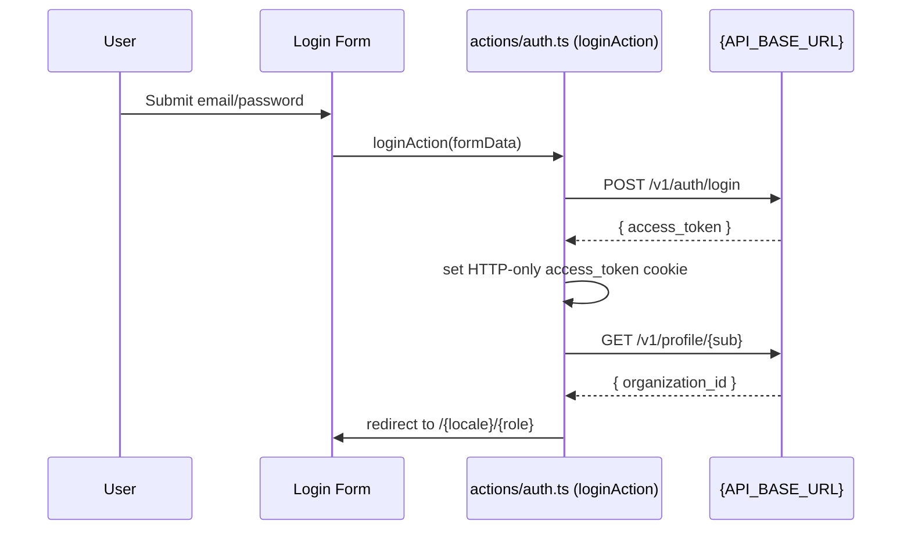
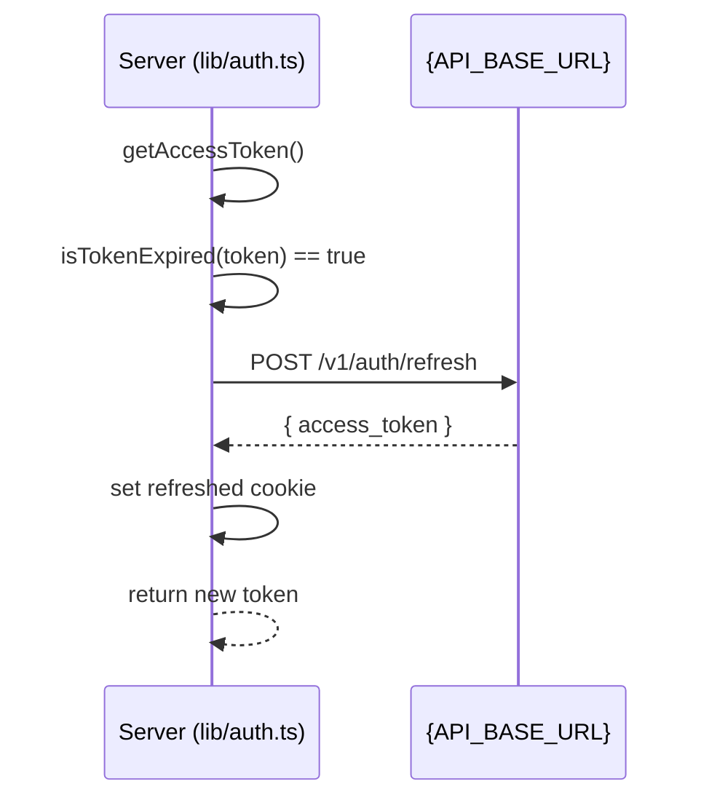
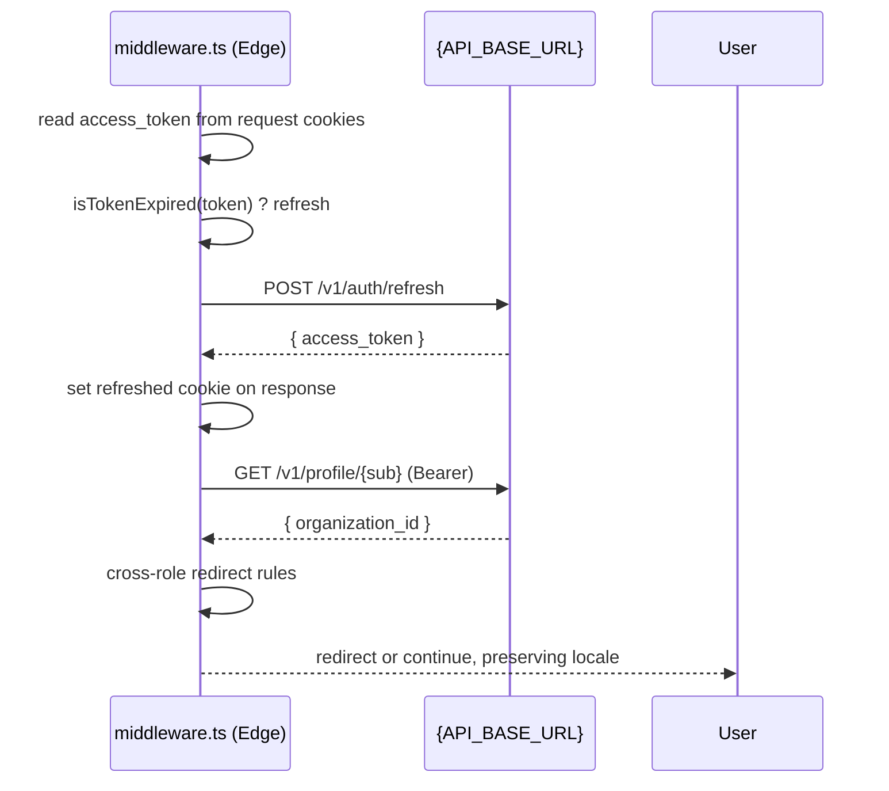

# Authentication & Authorization (AuthN/Z)

How authentication and authorization work in the Visio app.

- Locale-aware routing: `en`, `es`
- Role-based access control for Suppliers and Distributors

## Overview

Auth in Visio is based on a JWT `access_token` stored in an HTTP-only cookie. The system provides secure, role-based access control for supply chain stakeholders with automatic token management and cross-role protection.

The app performs:

- Token parsing and validation server-side
- Automatic token refresh using `POST {API_BASE_URL}/v1/auth/refresh` when the token is expired
- Role-based routing and cross-role protection based on the user profile organization
- Locale-aware redirection with i18n support
- Secure session management with HTTP-only cookies

Key components:

- `lib/auth.ts` — Core auth helpers (token, profile types, decode, refresh, routing helpers)
- `actions/auth.ts` — Server actions: `loginAction`, `logoutAction`, and `getUserProfile`
- `middleware.ts` — Edge middleware for locale routing, auth gate, and cross-role protection with token refresh
- `hooks/useAuth.ts` — Client-side helper for Login/Logout button states (no sensitive token handling on client)

---

## Tokens & Cookies

- The JWT `access_token` is stored in an HTTP-only cookie named `access_token`.
- On the server, we access cookies using `next/headers`:
  - `getAccessToken()` reads the cookie.
  - If the token is expired, `getAccessToken()` attempts a refresh and persists the new token cookie.
  - `clearAuthCookies()` deletes the `access_token` cookie (used on logout and error cases).

References:

- `lib/auth.ts` → `getAccessToken()`, `isTokenExpired()`, `refreshAccessToken()`

### Token Expiration Handling

- Token expiration is determined from the `exp` claim in the JWT payload.
- `isTokenExpired(token)` compares `Date.now()` with `exp * 1000`.
- If expired, `refreshAccessToken()` performs `POST {API_BASE_URL}/v1/auth/refresh` and expects a JSON body with a new `access_token`.
- On success, the cookie is updated; otherwise, the cookie is cleared and callers receive `null`.

---

## API Endpoints Used

- `POST {API_BASE_URL}/v1/auth/login` — Password grant login; returns `access_token`.
- `POST {API_BASE_URL}/v1/auth/logout` — Invalidate session server-side (best effort).
- `POST {API_BASE_URL}/v1/auth/refresh` — Refresh the access token using HTTP-only refresh cookie/session.
- `GET {API_BASE_URL}/v1/profile/{userId}` — Retrieve user profile for routing and UX.

Environment:

- Configure `API_BASE_URL` in your environment (e.g., `.env.local`).

---

## User Profile & Roles

The system supports two primary roles in the supply chain:

### Role Definitions

- **Supplier**: Organizations that create and send shipments to distributors

  - Organization ID: `fb25ba40-900b-4941-a4d9-3e0998187014`
  - Dashboard: `/{locale}/supplier`
  - Permissions: Create shipments, view own shipments, manage shipment items

- **Distributor**: Organizations that receive and verify shipments from suppliers
  - Organization ID: `aa4d3d80-ae51-43a6-861a-e98f1ffefe69`
  - Dashboard: `/{locale}/distributor`
  - Permissions: View received shipments, verify shipments, update shipment status

### Role-Based Access Control

Each user's role is determined by their `organization_id` in the user profile. The system enforces strict role-based access:

- Cross-role access is automatically prevented and redirected
- API endpoints validate user permissions based on organization context
- Shipment operations are scoped to the user's organization

### Helper Functions

- `getUserType(organizationId)` → `'supplier' | 'distributor' | null`
- `getDashboardPath(organizationId, locale)` → `/{locale}/{role}`

References:

- `lib/auth.ts` → `ORGANIZATION_TYPES`, `getUserType()`, `getDashboardPath()`

---

## Login Flow

1. The login form posts to `loginAction()`.
2. `loginAction()` calls `POST {API_BASE_URL}/v1/auth/login` with a password grant and sets `access_token` as an HTTP-only cookie on success.
3. After login, it fetches the user profile and redirects the user:
   - If a `redirectTo` param exists, redirect there.
   - Otherwise, compute dashboard path using `getDashboardPath()` and redirect to the correct role dashboard.

References:

- `actions/auth.ts` → `loginAction()`, `getUserProfile()`

---

## Logout Flow

1. `logoutAction()` optionally calls `POST {API_BASE_URL}/v1/auth/logout` (best-effort; failures are logged but do not block).
2. It clears the HTTP-only cookie using `clearAuthCookies()`.
3. Redirects to `/{locale}`.

References:

- `actions/auth.ts` → `logoutAction()`

---

## Getting User Profile

- Server action `getUserProfile()` reads the current access token via `getAccessToken()`.
- It decodes the token to obtain `sub` (userId).
- It calls `GET {API_BASE_URL}/v1/profile/{userId}` with `Authorization: Bearer <token>`.
- If it receives 401, it attempts a single refresh and retries once with the new token.

References:

- `actions/auth.ts` → `getUserProfile()`

---

## Middleware: Auth Gate, Token Refresh, Cross-Role Protection

- Runs on every request except API/static routes and Next internals.
- Extracts locale from the pathname for i18n routing.
- Reads `access_token` from request cookies; if expired, attempts a refresh:
  - Calls `POST {API_BASE_URL}/v1/auth/refresh`.
  - When successful, sets the new `access_token` on the outgoing response.
- Redirect behavior:
  - If visiting `/{locale}` and authenticated, redirect to the correct role dashboard.
  - Protected routes: `/supplier/*`, `/distributor/*` require authentication.
  - Cross-role access is prevented and auto-redirected to the correct dashboard.

References:

- `middleware.ts`

---

## Client-Side: Auth-Aware UI

- The client does not read the HTTP-only cookie directly.
- The `useAuth` hook manages UI state for Login/Logout buttons:
  - `isAuthenticated`, `user`, `isLoading`, and `logout()`.
  - It triggers server-side actions and API calls indirectly.

References:

- `hooks/useAuth.ts`

---

## Error Handling & Resilience

- Server-side functions catch and log errors without leaking sensitive details to the client.
- If token refresh fails, the system clears auth cookies and callers treat the user as unauthenticated.
- Middleware logs profile fetch failures but does not block static pages; it maintains graceful degradation.

---

## Internationalization (i18n)

- Locale is the first segment of the path (e.g., `/en`, `/es`).
- Middleware and redirect helpers preserve locale on navigations and redirects.

---

## Security Considerations

- **HTTP-only cookies**: `access_token` stored in HTTP-only cookie to mitigate XSS exposure
- **Secure token management**: Backend manages refresh tokens/cookies; frontend only calls `/v1/auth/refresh`
- **Bearer authentication**: Always use `Authorization: Bearer <token>` for API requests that require auth
- **Cookie security**: Cookies are set with `secure` in production, `sameSite: 'lax'`, and `path: '/'`
- **Role isolation**: Strict organization-based access control prevents cross-role data access
- **Token validation**: Server-side token validation on every protected request
- **Automatic cleanup**: Failed authentication attempts clear cookies and redirect appropriately

---

## Local Development Setup

1. Add environment variables in `.env.local`:
   - `API_BASE_URL=https://compliance.produce-x.com/api`
2. Run the app normally.
3. Verify login, role redirects, and refresh behavior by allowing a token to expire or forcing a 401.

---

## Sequence Diagrams

### Login + Redirect

### Request with Expired Token (Server-side)

### Middleware Refresh + Route Protection

---

## Common Pitfalls & Tips

- If `API_BASE_URL` is missing, login and refresh will fail. Ensure `.env.local` is configured.
- When testing refresh in middleware, remember that Edge runtime cannot use `credentials: 'include'`; cookies must be forwarded manually (implemented by adding `cookie` header from the incoming request).
- If profile requests return 401 repeatedly, confirm the backend sets/recognizes the refresh cookie/session for the `refresh` endpoint.

---

## File References

- `lib/auth.ts`

  - `decodeJWTPayload()`
  - `isTokenExpired()`
  - `refreshAccessToken()`
  - `getAccessToken()`
  - `clearAuthCookies()`
  - `getUserType()`, `getDashboardPath()`

- `actions/auth.ts`

  - `loginAction()`
  - `logoutAction()`
  - `getUserProfile()`

- `middleware.ts`

  - Locale handling (next-intl)
  - Auth gate and cross-role protection
  - Token refresh and cookie set on response

- `hooks/useAuth.ts`
  - Client-side UX state for auth-related components

---

## Future Enhancements

- Add silent background refresh scheduler for long-lived sessions (server-only).
